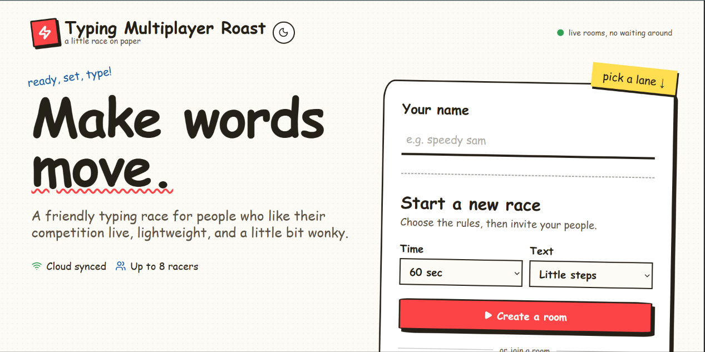
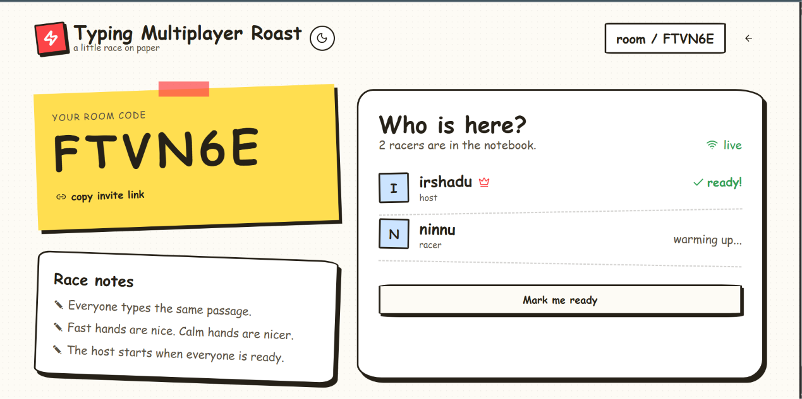
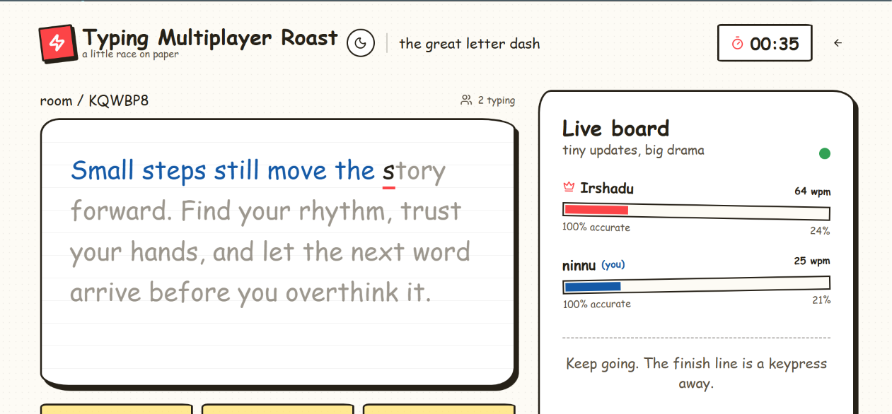

# Typing Multiplayer Roast

[Live site](https://typingmultiplayerroast.vercel.app/)

## Basic Details
### Team Name: Typing Multiplayer

### Team Members
- Team Lead: Irshadudheen P - EMEA College of Arts and Science 

### Project Description
A real-time multiplayer typing platform where users can create or join typing races and compete with others.

Track your WPM, accuracy, progress, and mistakes while racing through the same text in real time.

### The Problem (that doesn't exist)
People are getting dangerously good at typing alone — so we created a completely unnecessary way to turn typing practice into a multiplayer race.

### The Solution (that nobody asked for)
Turn typing practice into a chaotic multiplayer race with Malayalam voice effects, live competition, and real-time typing battles — because apparently typing alone wasn't stressful enough. 😄

## Technical Details
### Technologies/Components Used
For Software:
- TypeScript
- React
- React Hooks, Supabase Client
- Vite, Git, GitHub, Supabase

### Implementation
For Software:
# Installation
npm install

# Run
npm run dev

### Project Documentation
For Software:

# Screenshots

*Application landing page and race setup.*

*Multiplayer room and player readiness screen.*

*Live typing race and player progress.*

# Diagrams

*Add caption explaining your workflow*

For Hardware:

# Schematic & Circuit

*Add caption explaining connections*

*Add caption explaining the schematic*

# Build Photos

*List out all components shown*

*Explain the build steps*

*Explain the final build*

### Project Demo
# Video
[Add your demo video link here]
*Explain what the video demonstrates*

# Additional Demos
[Add any extra demo materials/links]

## Team Contributions
- [Name 1]: [Specific contributions]
- [Name 2]: [Specific contributions]
- [Name 3]: [Specific contributions]

---
Made with ❤️ at TinkerHub Useless Projects 

